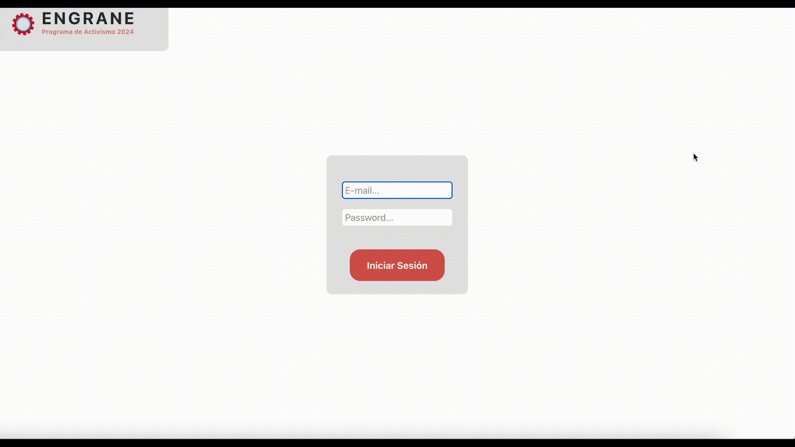
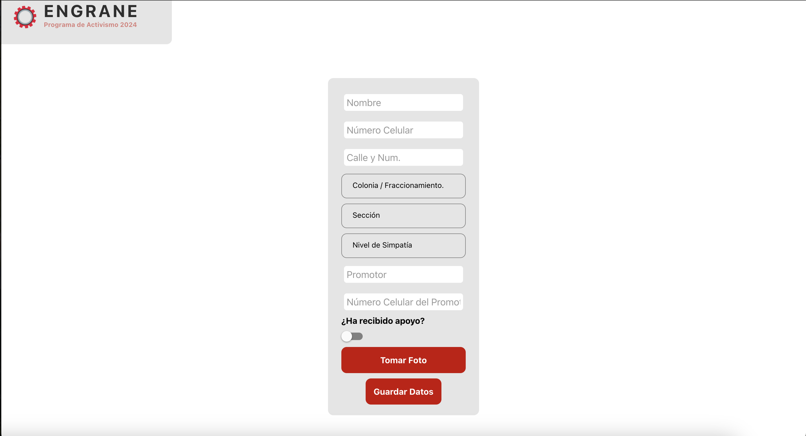
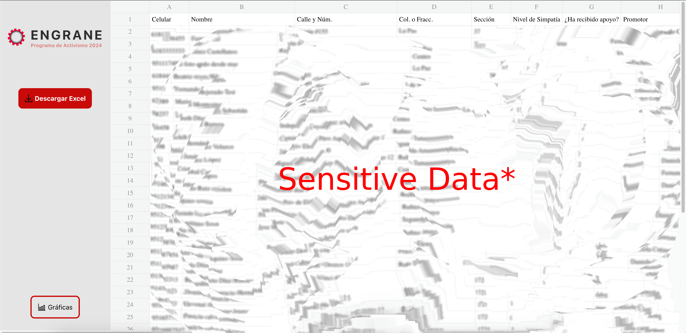

# EngraneShowcase

## Preview

### Landing Page (Sign In):

- Developed a sleek and easy to use interface for signing in.
- Implemented Firebase user authentication for secure sign in.

- Screenshot

- Gif

### Potential Voter Registry Page (Optimized for mobile use):

- Developed a user-friendly interface with text, number, select list and switch inputs as well as photo upload capabilities.
- Implemented a confirmation screen to verify user input.
- Implemented a repeated entry catcher to prevent data duplication.
- Seamlessly stored potential voter registrations in the Firebase database.

- Screenshot

- Gif

### Entry Query Page:

- Designed a powerful search engine allowing users to query the database by phone number or name.
- Ensured that only authorized users could access this feature, ensuring data privacy.
- Displayed search results promptly, providing a responsive user experience.

- Screenshot

- Gif

### Graphs Page:

- Crafted six distinct, animated graphs based on real-time data from the Firebase database.
- Implemented dynamic filters, enabling users to focus on specific data subsets.
- Ensured that only authorized personnel had access to this data visualization.
- Employed Firebase's real-time capabilities to keep the graphs up-to-date.

- Screenshot

- Gif

### Spreadsheet View Page:

- Created a spreadsheet view that presented data from the Firebase database in an organized format.
- Integrated a download button, allowing users to export data as .xls files for further analysis.
- Limited access to authorized personnel to protect sensitive data.
- Linked the spreadsheet view seamlessly with the dynamic graphs for comprehensive data analysis.

- Screenshot

- Gif

